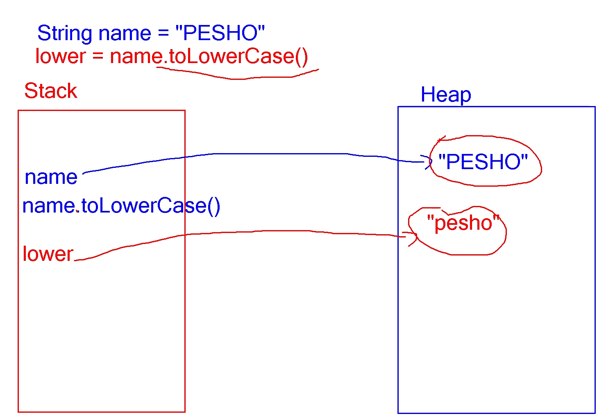
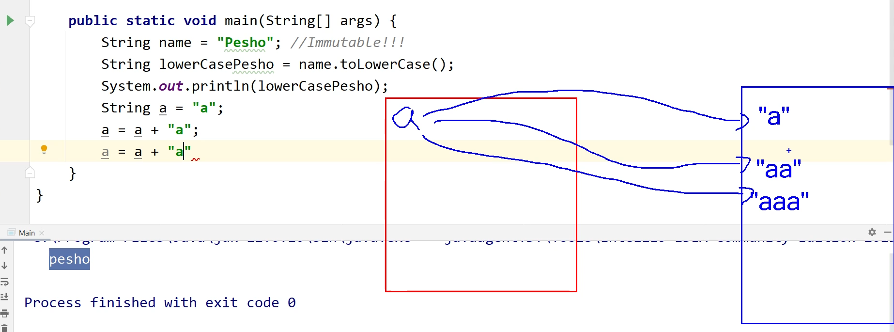
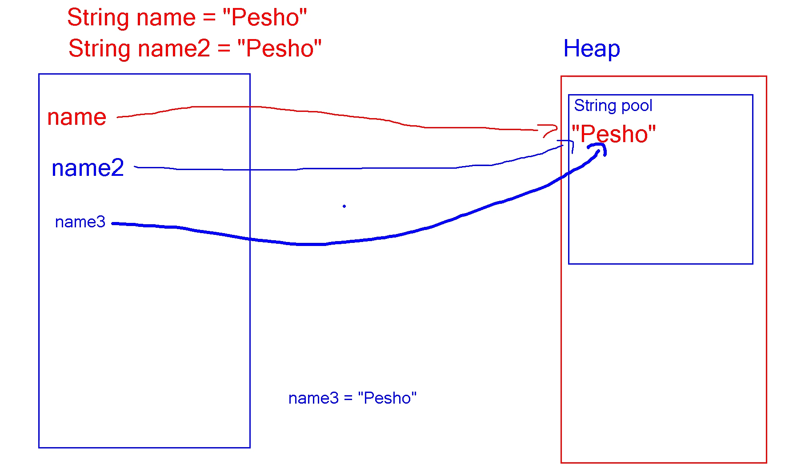

## Encapsulation

1. What is Encapsulation ? - когато с Access Modifiers крием информация и методи от крайния потребител
- крием инф от потребителя, която може да обърка нашата програма
- идеята е да пишем устойчив код; да пазим нашия код от зли мисли(променям, презаписвам)
- кода става по-лесен за използване
- reduces complexity
- objects must be private
- fields should be private
- use getters and setters for data access
- Accessors and Mutators should be private

This - reference to the current object

2.Access Modifiers
- private - objects hide data from the outside world; Aко една променлива е private,
то тя може да бъде използвана само и едниствена в класа, в който е декларирана
- public - Grants access to any class belonging to Java Universe; 
  дава достъп на променлива да бъде използване от всякъде, от всички класове
- protected - Grants access to subclasses; 
  позволява само на наследниците на този клас да я използват; и в класове, които са в същия пакет
- default - do not explicitly declare an access modifier; 
  без Access Modifier - позволява на променливи да се ползват в същия клас и пакет

- Classes and interfaces cannot be private
- data can be accessed only within the declared class itself

3.Validation
- Data Validation happens in setters
- Printing with System.out. couples your class
- The Client ca handle class exception
- Constructors use private setters with validation logic
- Guarantees valid state of an object in its creation

3. Mutable and Immutable Objects
- mutable - The contents of that instance can be altered(променена);нещо,което може да се променя (StringBuilder - променя директно обекта)
```java
Point point = new Point(0, 0);
point.setLocation(1, 2);
sout(point);
```
- immutable - The content of the instance cannot be altered; не може да се променя (String, какво и да му викнем създава копие(toLowerCase(), trim()..))
- Един стринг когато е създаден вече не можем да го променим
- Когато сравняваме обекти с ==, то ние сравняваме тяхното място в паметта
- 
Променливите са в Stack паметта, a обектите са в Heap
Когато кажем name.toLowerCase() -> в паметта се създава нов обект
- Всеки път, когато променяме, събираме някакъв стринг, то винаги се създава нов обект в паметта.
  Един стринг когато е създаден вече не можем да го променим
- Можем да създадем друг обект и да променим него(примера с 'а');

- 
-  
- затова събиране на стрингове не е добра практика. Използва се StringBuilder
 ### Защо стрингове са immutable ? 
- оптимизация, която е направена от JAVA, за да ни пести памет на комп.
- След създаването на променлива от пит String, java ще провери дали тази стойност (на променливата) вече съществува в string pool.
  Ако имаме, променливата също ще сочи към този обект в String pool. По този начин Java си спестява запазването на една и съща стойност
(в този случай Pesho) n на брой пъти.

- scanner не проверява за обекти в String pool. Той винаги създава нови обекти
- Отговорът защо са immutable e : ако кажа name.toUpperCase() -> ще се променя обекта в String pool и така всички останали променливи,
които сочат към този обект, ще бъдат променени. За да избегнем този проблем и да можем да преизолзваме стойности от басейна със стрингове,
Strings are immutable !!!

?? Въпрос даван на интервю 
Как можем да си създадем immutable object ? - обект, на който не можем да променяме стойностите
- не трябва да имеме setters(това не е единствената причина)
```java
        ImmutablePerson person = new ImmutablePerson("Ivan", 12, "Apple", "Orange");
        person.setName("Martin"); // променяме му името => той е mutable
        person.setAge(50);
        person.getFavouriteFruits().add("Something"); // Въпреки че нямаме setter, пак променяме обекта като му добавяме нови продукти => immutable
        System.out.println(person.getFavouriteFruits());
        
 public List<String> getFavouriteFruits() {
       // return favouriteFruits; Въпреки че нямаме setter, пак променяме обекта като му добавяме нови продукти => immutable

         return new ArrayList<>(this.favouriteFruits);
         // връща копие на списъка с плодове и когато се опитаме да променим нещо, няма да променим оригинала => immutable
        
         return Collections.unmodifiableList(this.favouriteFruits); 
         //връща лист, но хвърля грешка, когато някой се опита да променя стойности => immutable
    }
```
- Mutable Fields
- they are not fully encapsulated; the getter is like a setter(above in code);
- Immutable Fields - for securing our collection we can return Collections.unmodifiableList();