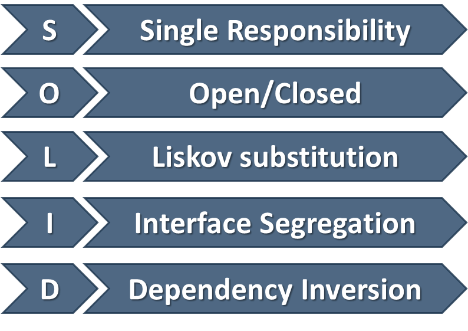

## S.O.L.I.D

- Ако спазваме Solid принципите до една ограмна част, то ние елиминираме грешки
при структурирането на кода и пишем по-добър, по- четим код(може да се поддържа лесно, дебъгва, разработва)
- Solid принципите са съвкупност от добри практите или добри идеи как да пишем обектно ориентиран код, за да
достигнем доста добро ниво на съставяне на нови функционалности на кода, организация на кода и разпределяне на кода(кой какво върши)

1. Single Responsibility Principle
- Class should only have one responsibility - един клас трябва да върши едно нещо; да има една отговорност
- Класове, които правям много неща наведнъж не са полезни. Не знам точно какъв клас е и точно какво прави
и не е достатъчно да се ориентираме само по името
- Reduces dependency complexity(намаляваме сложността на кода)
- Each additional responsibility is an axis to change the class
- Still, classes can have multiple methods. 
- Each method should have a single functionality part of the class responsibility
```java
public class HeroSettings {
  public static void changeName(Hero hero) {
    // Grant option to change name
  }
  public static void selectRole(Hero hero) {
    // Grant option to select role
  }
}
```


2.Open-Closed Principle
- Open for extension, but closed for modification - Кодът, който пишем да бъде отворен за добавяне на нови
функционалности(да бъде лесно да добавям нов feature), НО да не са налага да правя модификации
(без да променям вече създаденото)
- Design the code in a way that new functionality can be added with minimum changes in the existing code.

- Къде се използва този принцип ?
1. Extensibility(разтегливост)
- implementation takes future growth into consideration - Ако се появят нови необходимости от функционалсти 
на кода, въпроса е лесно ли мога да ги добавя или не? От отговора зависи дали съм спазила принципа.
- Идеята тук е да мислим за бъдещото развитие на кода, а не за текущото му състояние.
- New or modified functionality affects little or not at all the internal structure and data flow of the system
2. Reusability
- Идеята тук е да можем да направим отговорностите в кода, в който сме написали, да бъдат отделени по такъв начин,
че когато трябва да преизползвам нещо в новата функц, която добавяме, е да можем по лесен начин да го преизползваме.
А не да се налага да модифицираме това което вече го е имало, за да можем да го използваме в нова функц.
Нещата се преплитам с Single Responsibility Principle
- Software reusability refers to design features of a software element that enhance its suitability for reuse
- Modularity - отделните модули отговарят за отделни неща
- Low coupling - нямаме прекалено голяма зависимост и обвързаност между отделните модули
- High cohesion - 

OCP - Violations(нарушения)
- Cascading changes through modules - Когато правим една промяна, трябва да направим каскадни промени през модулите
- Each change requires re-testing
- Logic depends on conditional statements - Не винаги всичко трябва да зависи от тях. Можем да го постигнем с добър полиморфизъм

OCP - Solutions - Как постигаме добър OCP принцип
- Inheritance / Abstraction
- Inheritance / Template Method pattern
- Composition / Strategy patterns


3. Liskov substitution Principle 
- objects should be replaceable with instances of their subtypes without altering the correctness of the program
- Обектите заместват техните базови типове
- Един обект, който е наследник на базовия клас, не трябва да чупи функционалностите на базовия тип.
Трябва да има същите функ. като базовия тип. 
- Подсказва ни как можем да правим добро наследяяване
- Derived types must be completely substitutable for their base types
- Reference to the base class can be replaced with a derived class without affecting the functionality of the program module
- Derived classes extend without replacing the functionality of old classes.

LSP Relationships (Как го постигаме ?)
- OOP inheritance - чрез наследяване; Student is a Person
- Plus LSP - Student is substituted for Person (Студента е заместител на човека)

ОCP vs LCP 
- Liskov Substitution Principle is just an extension of the Open-Closed Principle
- We must make sure that new derived classes are extending the base classes without changing their behavior

LCP - Violations 
- Type checking(ако използваме instanceof);
- Overridden methods say "I am not implemented"
- Base class depends on its subtypes(Когато добавя нов наследник, не трябва да променям base class)

LCP - Solutions
- Refactoring in the base class


4. Interface segregation Principle
- many specific interfaces are better than one general interface
- един interface e по-добре да прави малко неща, отколкото да имаме един общ голям interface
- Един interface да има една отговорност
- Идеята тук е, че интерфейсите трябва да бъдат такива каквито са необходими в нашето приложение или в нашите модули,
така че да носят минималният брой функ., които задължават наследниците им да ги имплементират. 
- Clients should not be forced to depend on methods they do not use
Segregate Interfaces
- Prefer small, cohesive interfaces;
- Divide "fat" interfaces into "role" interfaces

Having "fat" interfaces => 
- Classes have methods they do not use; 
- Increased coupling
- Reduces flexibility
- Reduces maintainability

How to ISP ? Solutions to broken ISP =>
- Small interfaces
- Cohesive interfaces
- Let the client define interfaces - "role" interfaces;

5.Dependency inversion Principle
- one should depend upon abstractions, not concretions
- Идеята е, че когато разчитаме на абстракция можем да правим поломормофизъм.
- High-level modules should not depend on low-level modules.
- Both should depend on abstraction
- Abstractions should not depend on details
- Details should depend on abstraction
- Goal: decoupling between modules through abstraction

Dependency Examples
- A Dependency i s an external component / system - нещо външно за контекста, в който се намираме
- Може да е друг клас, който е външен за класа, в който се намираме;
- Framework, Configuration, Third party library, The new keyword, Database, Static method, FIle system, Global function
Email, Random generator, Web service

How to DIP ? Как постигаме Dependency inversion principle ?
- чрез абстракция в конструктора
- чрез Constructor injection - dependencies are passed through constructors
Pros -> Никой не може да инициализира обекта ни без да инжектира dependency; Works well without a container;
Always valid state
Cons -> Many parameters; Some methods may not need everything
// Example of Constructor injection
```java
public class Copy {
  private Reader reader;
  private Writer writer;
  public Copy(Reader reader, Writer writer) {
    this.reader = reader;
    this.writer = writer;
  }
  public void copyAll() {}
}
```
- чрез Setter injection - Dependencies are passed through setters
Pros -> Can be change anytime; Very flexible
Cons -> Possible invalid state of the object; Less intuitive
// Example pf Setter injection
```java
public class Copy {
  private Reader reader; 
  private Writer writer;
  public void setReader(Reader reader) {}
  public void setWriter(Writer writer) {}
  public void copyAll() {}
}
```
- чрез Parameter injection -Dependencies are passed through method parameters
Pros -> No change in rest of the class; Very flexible
Cons -> Many parameters; Breaks the method signature
```java
public class Copy {
  public void copyAll(Reader reader, Writer writer) {}
}
```